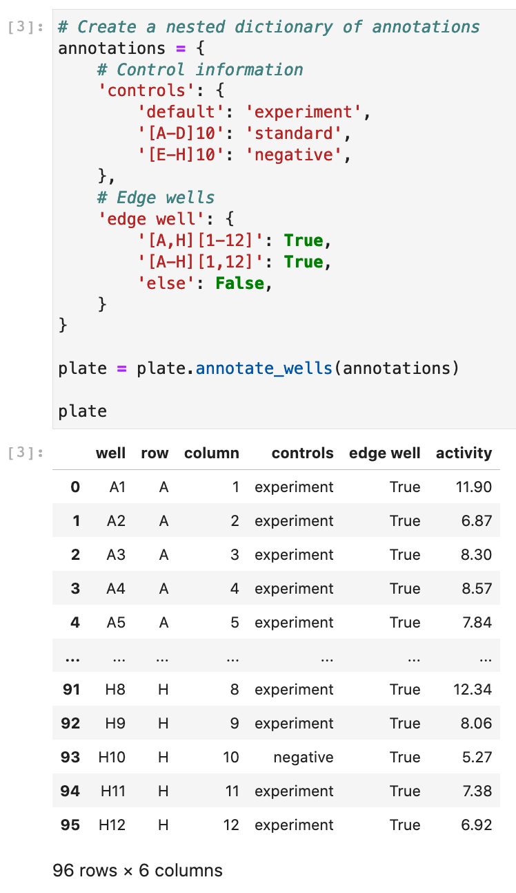

# ninetysix
A general package for annotating, processing, and visualizing 96-well* plate data.

(*_n_-well, really.)

### Note: This is a work in progress, and not yet ready for major release or use. 

A few functionalities (the `Plate()` class, generally, and `parsers.well_regex()`) are functional and usable, but not to their full extent. An intial release and push to PyPI will be made once all basic functionality is included.

## Purpose
`ninetysix` provides a method of combining well-value data pairs and efficiently adding additional information (e.g., controls, conditions) and processing and visualizing the results.

This primary works via the `Plate` class, but visualization tools are available for `pandas DataFrame` objects as well through `ninetysix.viz`.

### `ns.Plate`
A `Plate` object contains three major groups to describe a well:

`locations`, `annotations`, and `values`.

The data is always arrayed in that order. The 'most important' (or perhaps 'most relevant') value is set as the right-most column in the data, which is automatically used in downstream processing and visualization unless explicitly overwritten, thus saving time needing to specify what data use during exploratory data analysis.

New columns are assumed to be generic annotations, but can be moved to locations or values as necessary via the `Plate.set_as_location()` and `Plate.set_as_values()` methods, respecively.

#### Constructing a `Plate` object.

Construction of a `Plate` automatically adds 'row' and 'column' information, if not already present.

#### Annotation is of wells is streamlined via nested dictionaries and well regex.
 

Each outer dictionary's key is the name of the new data column, while the inner dictionarys' key-value pairs are the wells and their annotations for that new column. Simple regex is supported for well keys, and all unspecified wells can be annotated via the keys 'default', 'else', 'other', or 'standard' (otherwise will be labeled as `None`).

#### Using the annotations to further process the data.

The `normalize()` method allows you to rescale your data. Given no arguments, it will just scale the data in your value column to max out at 1. Additional arguments allow you to specify groups to set to 1. For example, `normalize(to='controls=standard')` says take the group `standard` in the columns `controls` and set the mean to 1, and recale everything else accordingly. Passing `zero=True` will set the lowest value to zero, and takes a string argument similar to the `to` kwarg to set a group's mean value to zero. See below for another example.

#### Visualizing the data.

Plotting functions are available as `Plate` methods or as functions from `ns.viz`, which take `Plate` or plate-like `DataFrame` objects and return visualizations. They default to using `value_name` (the right-most column in the data) on the y-axis, but this can be overwritten with the `value` kwarg in the mmethod/function.

#### Additional examples

Finally, we can make a heatmap of the plate, with the control wells highlighted (excluding the major group to reduce clutter, which in this case would just be the 'experiment' wells.).

### More coming soon!