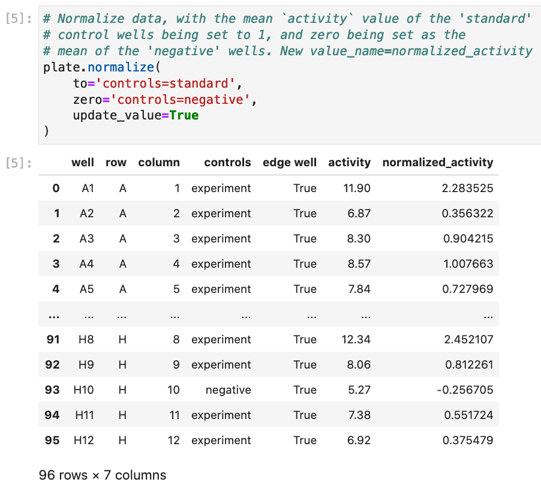
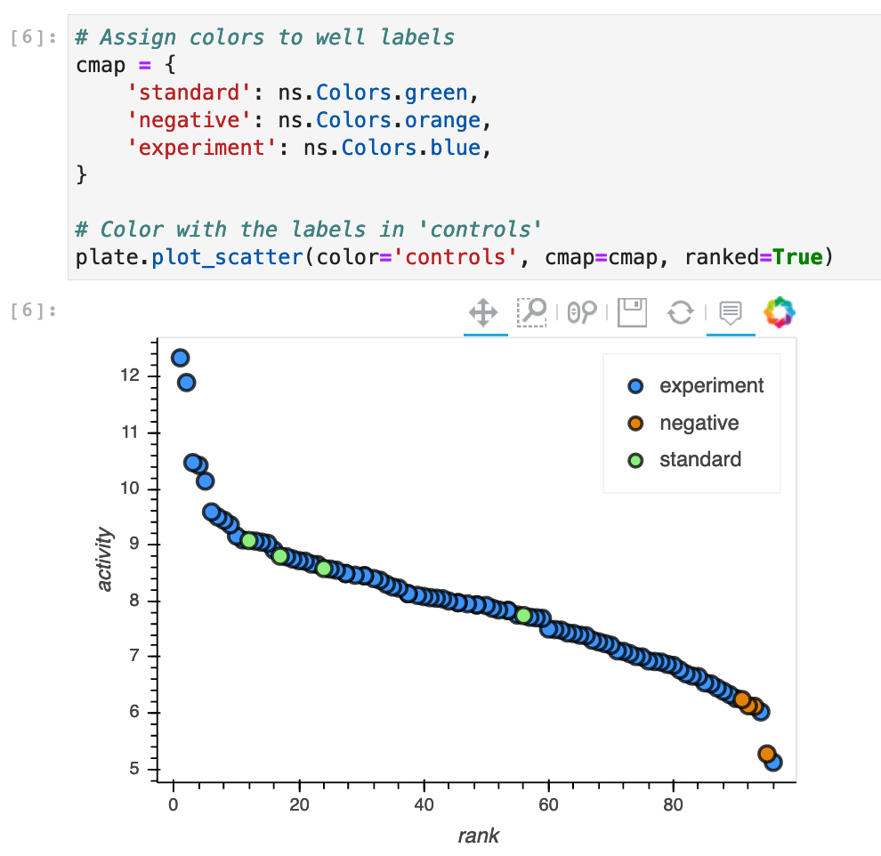

# ninetysix
A general package for annotating, processing, and visualizing 96-well* plate data.

(*_n_-well, really.)

## Purpose
`ninetysix` provides a method of combining well-value data pairs and efficiently adding additional information (e.g., controls, well conditions) and processing and visualizing the results.

This primarily works via the `Plate` class, but visualization tools are available for `pandas DataFrame` objects as well through `ninetysix.viz`.

## Install
```
pip install ninetysix
```
Although `jupyter lab` is not a strict dependency for `ninetysix`, much of the visualization functionality benefits from being run in a notebook. If your `jupyter lab` and other packages are up to date, the above `pip` install should suffice. If you have issues, the following conda environment should work:
```
# Create the environment with python and jupyterlab installed
conda create -n ns_env python jupyterlab

# Activate the environment
conda activate ns_env

# Install ninetysix and its dependencies
pip install ninetysix

# Open jupyter lab
jupyter lab
```

## Features
### `ninetysix.Plate`
The heart of this package, a `Plate` object contains three major groups to describe a well:

`locations`, `annotations`, and `values`,

which are always arrayed in that order.

#### `Plate` performs value-oriented operations
The 'most important' (or perhaps 'most relevant') `value` is set as the right-most column in the data, which is automatically used in downstream processing and visualization unless explicitly overwritten, thus saving time needing to specify what data to use during exploratory data analysis.

New columns are assumed to be generic `annotations`, but can be moved to `locations` or `values` as desired to streamline your processing and analysis (see **Examples** below).

#### `Plate` uses the flexibility of the `pandas DataFrame`
`Plate` objects have nearly all methods available to a `DataFrame` (e.g., `merge`), but will return a `Plate` object when possible.

```python
>>> import ninetysix as ns
>>> import pandas as pd

>>> # Create Plate
>>> plate = ns.Plate('example_data.csv')

>>> # Create DataFrame with only row A and column 'plate'
>>> df = pd.DataFrame({
...     'well': [f'A{i}' for i in range(1, 13)],
...     'plate': 1
... })

>>> # Call `pd.merge` from Plate
>>> merged_plate = plate.merge(df)

>>> # Returned object is a Plate
>>> type(merged_plate)

ninetysix.plate.Plate
```
This new plate object will retain the same `locations`, `annotations`, and `values` attributes.

### `ninetysix.parsers.well_regex`
Dictionaries with key-value pairs that represent a single well and information about it are a powerful way to add information to a plate, but writing 96 key-value pairs is cumbersome. To alleviate this, `ninetysix` provides `well_regex` in the `parsers` module, which accepts well keys written in a simple regex form and expands them.

```python
>>> from ninetysix.parsers import well_regex

>>> well_info = {
...     '[A-C]10': 'control',
...     '[A,H][1,12]': 'empty',
... }

>>> well_regex(well_info)

{'A10': 'control',
 'B10': 'control',
 'C10': 'control',
 'A1': 'empty',
 'A12': 'empty',
 'H1': 'empty',
 'H12': 'empty'}
```

### `ninetysix.viz`
Quick access to scatter charts, plate heatmaps, and aggregated charts are available for both `Plate` and `DataFrame` objects, leveraging the information encoded in these objects to generate annotated visualizations.

These plots are based on the `holoviews` (http://holoviews.org/) package with the `bokeh` backend. The chart outputs of `viz` can be further tuned using the tools provided in these packages.

Plotting functions are available directly as `Plate` methods for an efficient workflow:


### Examples
#### Constructing a `Plate` object.


Construction of a `Plate` automatically adds 'row' and 'column' information, if not already present.

#### Annotation is of wells is streamlined via nested dictionaries and `well_regex`.
 

Each outer key is the name of the new data column, while the inner key-value pairs are the wells and their annotations for that new column. Simple regex is supported for well keys, and all unspecified wells can be annotated via the keys 'default', 'else', 'other', or 'standard' (otherwise will be labeled as `None`).

#### Using the annotations to further process the data.


The `normalize()` method allows you to rescale your data. Given no arguments, it will just scale the data in your value column to max out at 1. Given `zero=True`, it will translate and scale your data to be exactly between zero and one.

Additional arguments allow you to specify groups to set to 1. For example, `normalize(to='controls=standard')` says take the group `standard` in the annotation column `controls` and set the mean to 1, and rescale everything else accordingly. `zero` also takes a string argument similar to the `to` kwarg to set a group's mean value to zero:



#### Visualizing the data.


Plotting functions are available as `Plate` methods or as functions from `ns.viz`, which take `Plate` or plate-like `DataFrame` objects and return visualizations. They default to using `value_name` (the right-most column in the `Plate` or `DataFrame`) on the y-axis, but this can be overwritten with the `value_name` kwarg in the mmethod/function.



Finally, we can make a heatmap of the plate, with the control wells highlighted (excluding the major/most prevalent group to reduce clutter, which in this case would just be the 'experiment' wells.).


#### Multi-`Plate` objects and `groupby` operations.
*(Note: in the future this will be available via the `Plates` class, but this is not yet implemented.)*

Plotting functions and the `Plate.normalize()` method take `groupby` arguments, which specifies how to group the data when performing operations. This is useful when your `Plate` object contains more than one plate, or the conditions within a plate should be kept separate, as assigned in a column in `annotations`.

This can be seen in the `ns_examples.ipynb` notebook, and results in data/visualizations like these:


